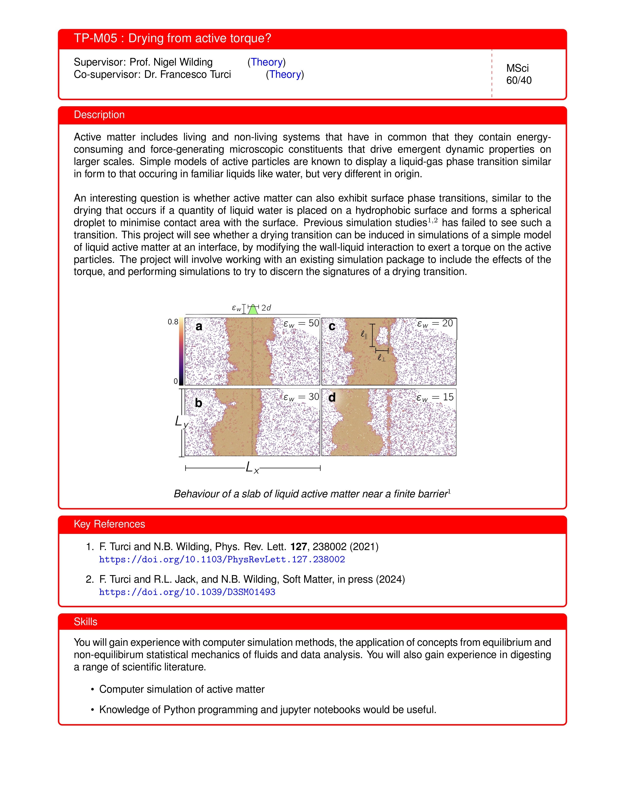

# Weekly notes on active matter PhD project

## Week 1

### 2024/9/21 Reading *What is a Complex System?*

By James Ladyman and Karoline Wiesner

My final-year MSci project involved the study of a complex system, foreign exchange markets. Each individual currency was treated as a spin in the Ising model, and by applying E.T. Jaynes's principle of maximum entropy, we discovered the structure of interactions between these entities. Remarkably, this simple model of magnetism can also describe the phase transitions of liquid-gas systems, as they fall into the same universality class. This model has even been extended to study how critical our brain is, giving rise to the field of the critical brain hypothesis. Therefore, many ideas during my research project were derived from neuroscience papers. The financial market and the brain: both are complex systems.

About a year ago, I read a paper published by James Ladyman, a professor of philosophy of science at Bristol, titled 'What is a Complex System?' (Ladyman et al., 2013). As I started my PhD at Bristol, my second supervisor, Francesco, mentioned that he also published a book about complexity. It became clear to me that I should read this book.

Chapter 1 presents The Truisms of Complexity Science as follows: 

*1. More is different.*

*2. Nonliving systems can generate order.*

*3. Complexity can come from simplicity.*

*4. Coordinated behaviour does not require an overall controller.*

*5. Complex systems are often modelled as networks or information processing systems.*

*6. There are various kinds of invariance and forms of universal behaviour in complex systems.*

*7. Complexity science is computational and probabilistic.*

*8. Complexity science involves multiple disciplines.*

*9. There is a difference between the order that complex systems produce and the order of the complex systems themselves.*

Features that are necessary and sufficient for which kinds of complexity and complex system are as follows: 

*1. Numerosity: complex systems involve many interactions among many components.*

*2. Disorder and diversity: the interactions in a complex system are not coordinated or controlled centrally, and the components may differ.*

*3. Feedback: the interactions in complex systems are iterated so that there is feedback from previous interactions on a time scale relevant to the system’s emergent dynamics.*

*4. Non-equilibrium: complex systems are open to the environment and are often driven by something external.*

*5. Spontaneous order and self-organisation: complex systems exhibit structure and order that arises out of the interactions among their parts.*

*6. Nonlinearity: complex systems exhibit nonlinear dependence on parameters or external drivers.*

*7. Robustness: the structure and function of complex systems is stable under relevant perturbations.*

*8. Nested structure and modularity: there may be multiple scales of structure, clustering and specialisation of function in complex systems.*

*9. History and memory: complex systems often require a very long history to exist and often store information about history.*

*10. Adaptive behaviour: complex systems are often able to modify their behaviour depending on the state of the environment and the predictions they make about it.*

## Week 2

### 2024/9/27 Things I did so far

1. Busy weeks due to starting three teaching modules: [Weekly update of my TSR (Teaching Support Roles)](onenote:Overview.one#Links&section-id={D4B227EF-F9FF-864E-A042-9B9A7C2E06E3}&page-id={B7874627-D52D-5043-9E1A-2067E68FAD02}&object-id={537C7D03-2CEB-3142-8063-0EF93BF5A5E9}&25&base-path=https://uob-my.sharepoint.com/personal/sp13328_bristol_ac_uk/Documents/PhD%20in%20Active%20Matter). Looking back, I wish I could have completed more reading, as there isn’t much to talk about in terms of active matter research for the next project meeting on Monday.

2. Reading *What is a Complex System?* by James Ladyman and Karoline Wiesner. The purpose of reading is to understand how systems out of thermodynamic equilibrium (a feature of complex systems) relate to a wide range of concepts associated with complexity.

   • There was a video that helped clarify what is meant by a Markov chain and a stochastic process being stationary: [Markov Chains Clearly Explained! Part - 1](https://www.youtube.com/watch?v=i3AkTO9HLXo&list=PLM8wYQRetTxBkdvBtz-gw8b9lcVkdXQKV). His other videos are helpful as well. For example, when I saw $P_{ij}^{(n)} = A_{ij}^n$ from the *n-Step Transition Matrix* video (Part 3), it was quite surprising. However, the Part 5 video on hidden Markov models wasn’t very helpful, but reading the appendix in the book was sufficient.

   • What I’ve felt from reading this book (currently at p.90) is that it presents a lot of different ideas and has interesting discussions on the history of science, but I only seem to get excited when it starts mentioning the brain. I'm not sure if I’m necessarily interested in quantifying complexity. From the Apple notes on 28/9/2024:

   *As I’m reading through *What is a Complex System?*, it seems that the description of a complex system arises as we have more representations at different scales of analysis. The concept of ‘complexity’ was destined to arise as the scientific era evolved.  
   Non-equilibrium systems arise because we define what systems are in thermodynamic equilibrium, which are idealisations.  
   Things that fail to be idealised fall into this dualistic concept: non-equilibrium.*

## Week 3
### 2024/9/30 Weekly project meeting

#### Things to discuss

1. Meeting with Max on Friday at noon (4th of Oct), thinking of going to Budapest Café

2. ‘Setting Expectations’ document

3. Two conferences to join:

    • [The Dao of Complexity workshop](https://iop.eventsair.com/doc2024)

    • [The Statistical Physics of Cognition](http://complexity-physics.org/blog/2024/08/19/the-statistical-physics-of-cognition)

    So, a trip to London, how to sort out things with Clarity, and other arrangements.

4. Set up [RDSF](https://uob.sharepoint.com/sites/itservices/SitePages/filestores.aspx) data storage
(Though I checked, OneDrive for Business offers 2TB of storage: [Overview of OneDrive for Business](https://uob.sharepoint.com/sites/systemsupport/SitePages/onedrive-overview.aspx))

5. Brief plan discussion: reading Mary Coe's thesis, then *Understanding Molecular Simulation* book

6. Are there MSci students working on this project?

<!-- 

---

#### Apps to install on university MacBook

1. AdGuard
2. Text Blaze
-->

### 2024/10/2 Why are the clouds at the same height when I look at the cloudy sky?

When we observe clouds appearing at the same height, it's often due to a phenomenon where a particular layer of the atmosphere has the right conditions for cloud formation. In the troposphere (the lowest layer of the atmosphere), clouds form when the air cools to its dew point, causing water vapour to condense into droplets or ice crystals. This typically happens at specific altitudes where temperature and pressure conditions are ideal for condensation.

Clouds that seem to form at the same height are likely part of the same atmospheric layer, known as a *cloud base*. The cloud base marks the altitude at which rising air reaches its dew point. If the conditions across the sky are uniform, we’ll see many clouds forming at roughly the same altitude, giving the illusion of a flat layer of clouds.

Cloud formation is fundamentally a non-equilibrium process. It results from dynamic atmospheric conditions like rising air currents, changes in temperature and pressure, and the continuous exchange of energy. These factors drive processes such as condensation and evaporation, which are inherently out of equilibrium. This aligns with the behavior of active matter systems, where each particle consumes energy to move, keeping the system perpetually out of equilibrium.

To create an effective repulsion in our ABP simulations, we consider modifying the wall-fluid interactions to induce a torque that reorients particles away from the surface. One approach might be to introduce an anisotropic interaction potential near the wall. When an ABP approaches the surface, this potential could apply a torque that turns the particle's propulsion direction away from the wall, effectively reducing its tendency to accumulate there. 

<!-- 
Implementing this in a molecular dynamics simulation involves adding a torque term to the equations of motion for particles near the wall. By carefully tuning the strength and range of this torque, you can simulate an effective repulsion. This may enable the system to undergo a drying transition, analogous to how insufficient moisture and rising warm air can prevent cloud formation below a certain altitude. Studying how this modification affects the phase behavior of the system could provide insights into the critical properties of the drying transition in active matter.
-->

#### I wasn’t sure how to implement this, so I asked ChatGPT.

